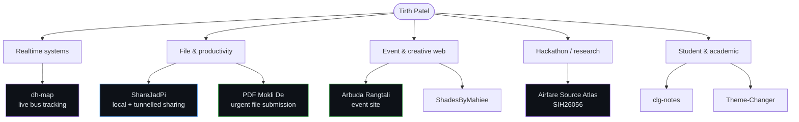
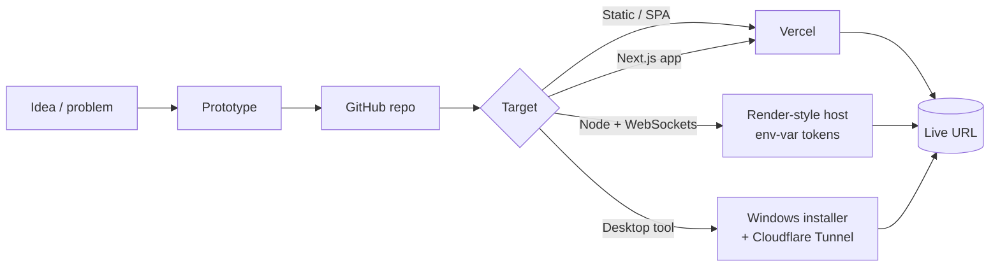

<div align="center">


</div>

```text
$ whoami
tirth-patel  →  builds small, useful software and ships it to a URL

$ ls ./systems
realtime-tracking/   file-sharing/   student-utilities/   event-web/   sih-research/

$ cat ./principle
start from a concrete problem. build the smallest thing that solves it. deploy it. iterate.
```

---

## `> NAVIGATION`

[Featured builds](#-featured-builds) · [Project map](#-project-constellation) · [Systems](#-systems-ive-built) · [Tech landscape](#-technology-landscape) · [Deployment map](#-from-idea-to-deployment) · [Build DNA](#-build-dna) · [Status board](#-status-board) · [Numbers](#-numbers-that-matter) · [Index](#-repository-index)

---

## 🚀 FEATURED BUILDS

<table>
<tr>
<td width="50%" valign="top">

### ✈️ Airfare Source Atlas
**SIH26056 · source registry** · 🟣 PROTOTYPE

A structured, searchable registry of airfare data sources — airlines, OTAs, flight-booking sites, metasearch engines and aggregators — assembled for Smart India Hackathon problem statement SIH26056.

`Next.js` `TypeScript` `Vercel` `CSV / XLSX datasets`

- Four curated datasets: **India airlines**, **India OTAs**, **metasearch & aggregators**, and a **combined registry** (CSV + XLSX)
- Research-focused explore / filter / verify interface
- Live on Vercel

[Live](https://airfare-source-atlas.vercel.app) · [Repo](https://github.com/tirth-patel29/Airfare-Source-Atlas)

</td>
<td width="50%" valign="top">

### 🚌 Dhanlaxmi Map (`dh-map`)
**Real-time bus tracking** · 🟣 PROTOTYPE

A live bus-tracking web app: a driver page streams GPS, a passenger page shows the bus moving on a map with its route trail.

`Node.js` `Express` `Socket.io` `Leaflet` `OpenStreetMap`

- WebSocket broadcast of live location; multi-bus support
- **Token-gated driver page** — invalid tokens are rejected on every update
- **Single active tracker per bus**, auto-released after 20 s of silence
- Passenger-side freshness status: 🟢 Live (<10 s) · 🟡 Weak (<30 s) · 🔴 Offline
- Tokens moved to environment variables; deployment notes for Render included

[Repo](https://github.com/tirth-patel29/dh-map)

</td>
</tr>
<tr>
<td width="50%" valign="top">

### ⚡ ShareJadPi
**Local + public file sharing** · 🔵 ACTIVE (fork)

A Windows file-sharing tool: right-click any file or folder to share it over local Wi-Fi, or expose it to the internet through a Cloudflare Tunnel with no port-forwarding.

`Python` `Cloudflare Tunnel` `QR access` `System tray`

- Token-based access; online mode redirects only once the tunnel answers a health check
- Background folder zipping with progress, clipboard sync, speed test
- Large-file handling and a dark responsive web UI

> Maintained as a fork of [`hetcharusat/sharejadpi`](https://github.com/hetcharusat/sharejadpi). Upstream authorship is credited there.

[Live](https://sharejadpi.vercel.app) · [Repo](https://github.com/tirth-patel29/sharejadpi)

</td>
<td width="50%" valign="top">

### 📄 PDF Mokli De
**Student file-submission utility** · 🟢 LIVE

Built around one scenario: *you're away from your desk — say at a clinic — and suddenly have to submit a practical or an important file.*

`React` `TypeScript` `Vite` `Vercel`

- React + TypeScript + Vite single-page app
- Deployed on Vercel

<sub>Feature-level details not yet verified from source.</sub>

[Live](https://habhai-mdi-gai-file.vercel.app) · [Repo](https://github.com/tirth-patel29/pdf-mokli-de)

</td>
</tr>
<tr>
<td width="50%" valign="top">

### 🪩 Arbuda Rangtali
**Event experience site** · 🟢 LIVE

A cinematic single-page site for a 10-night Garba / Navratri event: event-focused visual design.

`React` `TypeScript` `Vite` `shadcn/ui` `Bun` `Vercel`

- Scaffolded with Lovable, then maintained as a normal Vite + TypeScript codebase
- Deployed on Vercel

[Live](https://arbuda-rangtali26.vercel.app) · [Repo](https://github.com/tirth-patel29/arbuda-rangtali-garba)

</td>
<td width="50%" valign="top">

### 🎨 ShadesByMahiee · 💻 CrudeAI Terminal
**Frontend builds** · TypeScript

Two further TypeScript projects, pinned on the profile.

[ShadesByMahiee](https://github.com/tirth-patel29/shadesbymahiee) · [crudeai-terminal](https://github.com/tirth-patel29/crudeai-terminal)

<sub>Detailed write-ups to be added.</sub>

</td>
</tr>
</table>

---

## 🌌 PROJECT CONSTELLATION



**Cross-project patterns visible in the code**

| Link | What connects them |
|---|---|
| `PDF Mokli De` ↔ `ShareJadPi` | Both move files from *where you are* to *where they're needed*, with minimal friction |
| `Arbuda Rangtali` ↔ `ShadesByMahiee` | Same TypeScript frontend toolchain, visual-first brief |
| `Airfare Source Atlas` ↔ `dh-map` | Data-organisation and real-time-data problems from real-world scenarios |

---

## 🧩 SYSTEMS I'VE BUILT

| Category | Systems |
|---|---|
| **Realtime systems** | `dh-map` — WebSocket location pipeline with tracker authorisation and stale-tracker recovery |
| **File & sharing systems** | `ShareJadPi` (tunnelled sharing, tray app, installer), `PDF Mokli De` |
| **Hackathon systems** | `Airfare Source Atlas` (SIH26056) |
| **Creative experiences** | `Arbuda Rangtali`, `ShadesByMahiee` |
| **Student utilities** | `PDF Mokli De`, `clg-notes` (semester notes & question-paper archive) |
| **Developer tools** | `Theme-Changer` (theme switching for GitHub repos), `crudeai-terminal` |

---

## 🛠 TECHNOLOGY LANDSCAPE

> Every badge below is backed by a file in one of the repositories.

**Frontend**  


**Backend & realtime**  


**Maps & geo**  


**Deployment & networking**  


**Tooling**  


**Data formats:** CSV · XLSX (source registries)

---

## 🌐 FROM IDEA TO DEPLOYMENT



| Project | Deployed via | Live URL |
|---|---|---|
| Airfare Source Atlas | Vercel | [airfare-source-atlas.vercel.app](https://airfare-source-atlas.vercel.app) |
| PDF Mokli De | Vercel | [habhai-mdi-gai-file.vercel.app](https://habhai-mdi-gai-file.vercel.app) |
| Arbuda Rangtali | Vercel | [arbuda-rangtali26.vercel.app](https://arbuda-rangtali26.vercel.app) |
| ShareJadPi | Vercel (landing page) + Windows installer | [sharejadpi.vercel.app](https://sharejadpi.vercel.app) |
| dh-map | Self-hosted / Render (documented in `DEPLOYMENT.md`) | — |

---

## 🧬 BUILD DNA

```text
REAL PROBLEM ──► SMALL INTERFACE ──► THIN BACKEND ──► DEPLOY EARLY ──► ITERATE
```

Patterns that repeat across the repositories:

1. **Scenario-first framing.** `PDF Mokli De` starts from a concrete moment (a file due while you're away from your desk); `dh-map` starts from two named buses. The problem statement comes before the tech.
2. **Ship to a URL.** Four of the pinned projects have live Vercel deployments; the repos I inspected have only a handful of commits each, which points to short build-and-ship cycles.
3. **Security thinking even in small tools.** Token-gated tracker in `dh-map`, single-tracker locking and auto-expiry, environment-variable secrets, token-based access and cookie hand-off in `ShareJadPi`.
4. **Real-time and networking curiosity.** Socket.io broadcast pipelines, Cloudflare Tunnel for zero-config public sharing.
5. **Structured data as a product.** `Airfare Source Atlas` treats a research spreadsheet as the core asset and builds an interface around it.
6. **Fast frontend toolchains.** Vite, Next.js, Bun, shadcn/ui, modern linters — plus AI-assisted scaffolding where it speeds things up.

---

## 🚦 STATUS BOARD

| Status | Projects |
|---|---|
| 🟢 **LIVE** | PDF Mokli De · Arbuda Rangtali |
| 🔵 **ACTIVE** | ShareJadPi (fork, versioned releases) |
| 🟣 **PROTOTYPE** | Airfare Source Atlas · dh-map |
| 🟡 **EXPERIMENT** | crudeai-terminal |
| ⚫ **ARCHIVED** | clg-notes · Theme-Changer |

<sub>Statuses reflect repository evidence only (live URL, commit count, own README). They will change as projects evolve.</sub>

---

## 📊 NUMBERS THAT MATTER

| Metric | Value | Source |
|---|---|---|
| Public repositories | **43** (28 + 15) | Profile counts on both accounts |
| Live deployed projects | **4** | Vercel links in repo "About" |
| Hackathon-context projects | **1** verified (SIH26056) | Repo description |
| Real-time systems | **1** | dh-map |
| Curated data files | **5** | Airfare Source Atlas |

---

## ⏳ BUILD ORDER

Exact dates aren't shown in the repository pages, so this is a *relative* order from repository creation IDs:

```text
dh-map  ─►  ShareJadPi (fork)  ─►  Arbuda Rangtali  ─►  PDF Mokli De  ─►  Airfare Source Atlas
```

---

## 🧪 EXPERIMENTS & ARCHIVE

| Repo | Note |
|---|---|
| [`clg-notes`](https://github.com/tirthpatel2543/clg-notes) | Semester notes and question-paper archive for university courses (HTML) |
| [`Theme-Changer`](https://github.com/tirthpatel2543/Theme-Changer) | JavaScript tool for switching visual themes on GitHub repositories |
| [`crudeai-terminal`](https://github.com/tirth-patel29/crudeai-terminal) | TypeScript terminal-style interface |

<!--
  TO ADD once verified against the actual repos:
  AttendX ecosystem · OracleAuth · DNK · Sahjanand Smart Gate · Gujarati Census Survey
-->

---


## 🔭 CURRENTLY BUILDING

```text
▸ (fill in with what you're actually working on right now)
```

---

## 🗂 REPOSITORY INDEX

| Account | Repo | Type | Stack | Status |
|---|---|---|---|---|
| tirth-patel29 | [Airfare-Source-Atlas](https://github.com/tirth-patel29/Airfare-Source-Atlas) | Hackathon / data | Next.js, TS | 🟣 |
| tirth-patel29 | [dh-map](https://github.com/tirth-patel29/dh-map) | Realtime | Node, Socket.io, Leaflet | 🟣 |
| tirth-patel29 | [sharejadpi](https://github.com/tirth-patel29/sharejadpi) | Tool (fork) | Python | 🔵 |
| tirth-patel29 | [pdf-mokli-de](https://github.com/tirth-patel29/pdf-mokli-de) | Student utility | React, TS, Vite | 🟢 |
| tirth-patel29 | [arbuda-rangtali-garba](https://github.com/tirth-patel29/arbuda-rangtali-garba) | Creative web | React, TS, Vite | 🟢 |
| tirth-patel29 | [shadesbymahiee](https://github.com/tirth-patel29/shadesbymahiee) | Creative web | TS | — |
| tirth-patel29 | [crudeai-terminal](https://github.com/tirth-patel29/crudeai-terminal) | Experiment | TS | 🟡 |
| tirthpatel2543 | [clg-notes](https://github.com/tirthpatel2543/clg-notes) | Academic | HTML | ⚫ |
| tirthpatel2543 | [Theme-Changer](https://github.com/tirthpatel2543/Theme-Changer) | Dev utility | JavaScript | ⚫ |

---

<div align="center">

**This isn't a list of repositories — it's an index of systems.**

[](https://github.com/tirth-patel29)
[](https://github.com/tirthpatel2543)

</div>
